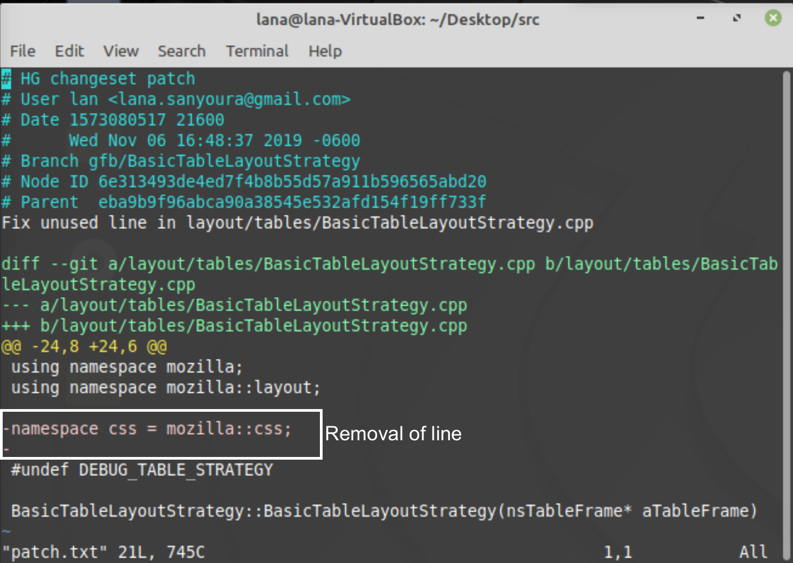
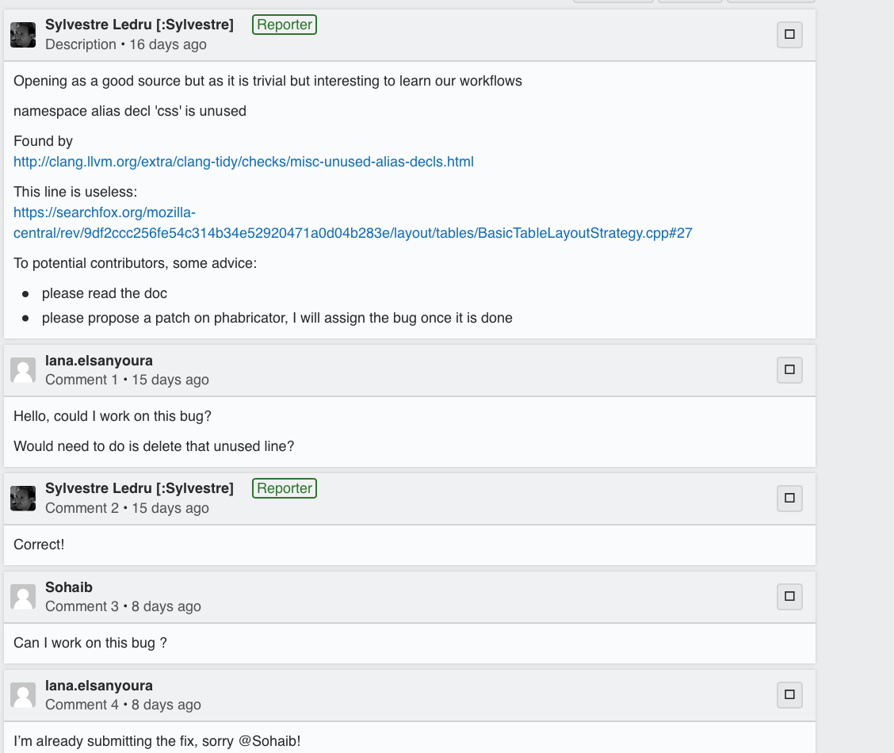

## 1. Link to bug:
https://bugzilla.mozilla.org/show_bug.cgi?id=1592623

## 2. Bug Diagnosis and Risks
The namespace alias declaration 'css' is unused in the c++ file: mozilla-central/layout/tables/BasicTableLayoutStrategy.cpp. 
The only risks are that we may need to add this declaration later, but that can be added by the developers working on it themselves. 
It's important to remove this bug because removing unused code maintains style and efficiency.

## 3. Fix Procedure
The procedure to fix this bug is a simple removal of the declaration, I used hg during development. 
I commented and asked my mentor about whether I was on the right track, thus fulfilling the collaboration metric: 

## 4.Testing
This fix required the removal of an unused line, therefore, testing the change would be a manual check if the line is no longer there. 
After that, we need to ensure our changes did not change the functionality of the website and that the codebase still built. 
Therefore, I rebuilt the codebase, and ran the website through mach run. 

## Pull Request: 
I created a pull request on a seperate branch and then merged it into master, here is the diff of my change on github as well:
https://github.com/lanaelsanyoura/gecko-dev/commit/ae63ebfb54930d87b05515fcb0ced5431454b69b#diff-24bc0016026a52d7fe8944fee2948ef3

Note:
I asked to work on this bug on Oct.30th as shown through bugzilla and created the commit on November 6th as specified in this patch.
This bug was then fixed and submitted on November 10th by another developer. I asked the Professor if it was alright that my bug was 
submitted by someone else before I had had the chance to and he said it was alright.

